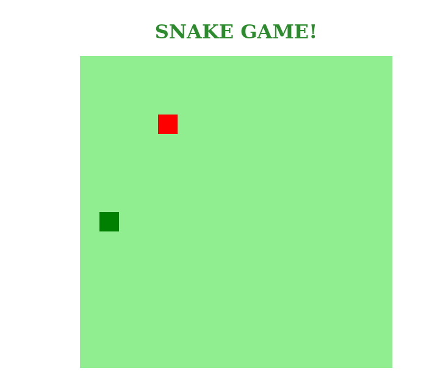

# Jogo da cobrinha utilizando HTML, CSS e JavaScript

    Já pensou em criar seu próprio jogo do zero?  
    Aprenda a desenvolver de forma simples o clássico jogo da cobrinha utilizando HTML, CSS e JavaScript.

